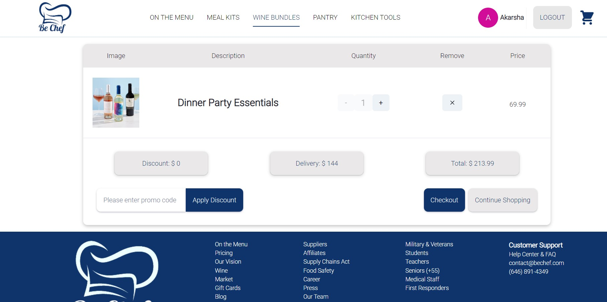

# BeChef 
# BeChef_OverView

This is the photos of the Bechef website. Bechef is an online Ecommerce Website which is providing high quality food products as well as easy to cook meals. From this website, users can Order food products cooked as well as raw and much more across the world.

**To see the live site click the below link.**

https://funny-pegasus-c3b55b.netlify.app/

## Built with
<ul>
  <li>React js</li>
  <li>Redux</li>
  <li>HTML</li>
  <li>CSS</li>
  <li>JavaScript</li>
  <li>Node Js</li>
  <li>MongoDbAtlas</li>
</ul>

## Used libraries
<ul>
  <li>node modules</li>
  <li>Styled-Components</li>
  <li>axios</li>
  <li>React Js</li>
  <li>Redux</li>
  <li>React-router-dom</li>
  <li>Chakra-UI</li>
  <li>Chakra-UI-Icons</li>
  <li>React Icons</li>
   <li>Express</li>
    <li>Nodemon</li>
   <li>Mongoose</li>
    <li>JsonWebToken</li>
</ul>

## Features
<ul>
  <li>Signup</li>
  <li>Login</li>
    <li>Sorting</li>
  <li>Individual Item Pages</li>
  <li>Filtering glasses by their Type and category including price,quantity and packs</li>
   <li>Responsive</li>
   <li>Authentication and Authorization</li>
   <li>Admin Section</li>
   <li>Full fledeged Crud Operations</li>
   <li>Device Friendly and Platform Independent</li>
   <li>Cart and Checkout Functionalities</li>
</ul>

## Some screenshots of the project

### Thanks for reading
